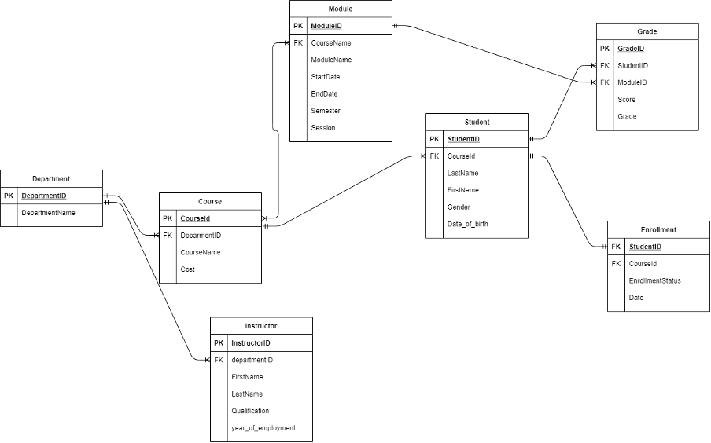

# University Data Warehouse

A brief description of what this project does and who it's for
## Authors

- [Akinkunmi Mustapha](https://github.com/OlamideMustapha)
- Aishwary Singh Gaur 
- Gulnaz 
## Business Problem

## Data
The data used to build this data warehouse is a fictional dataset generated using [Mockaroo](https://www.mockaroo.com/). The relational database contained 7 tables for each entity of the business model; the figure below is an entity relationship diagram of the relational database.

